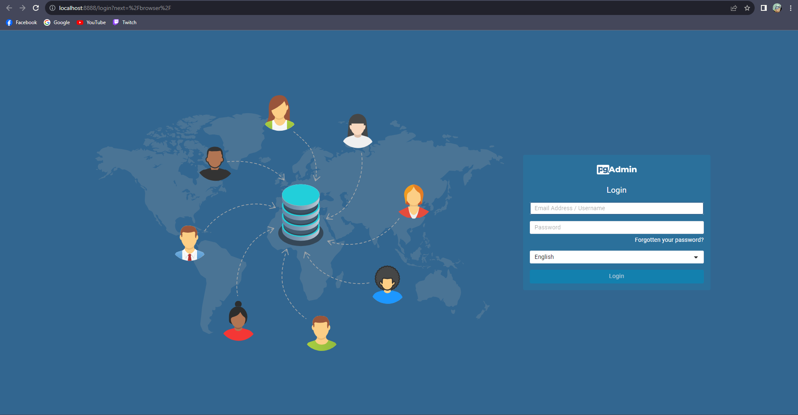
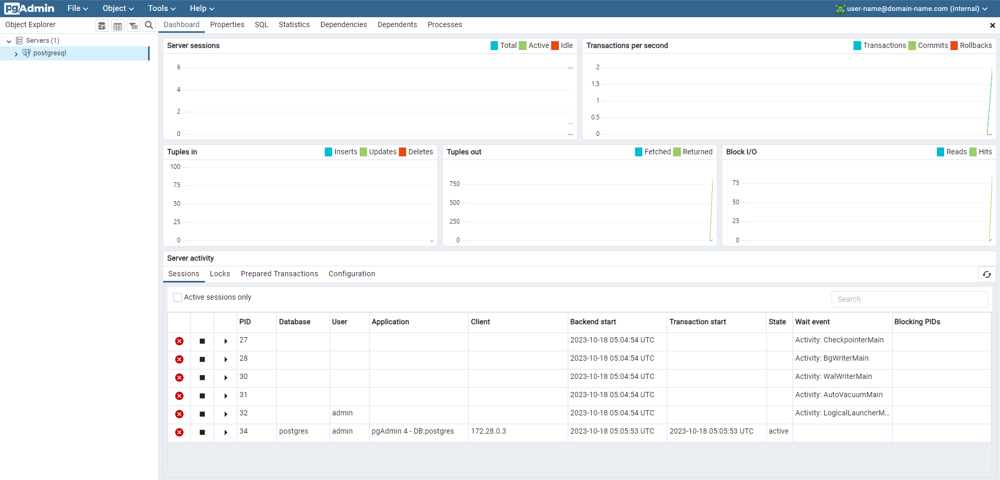
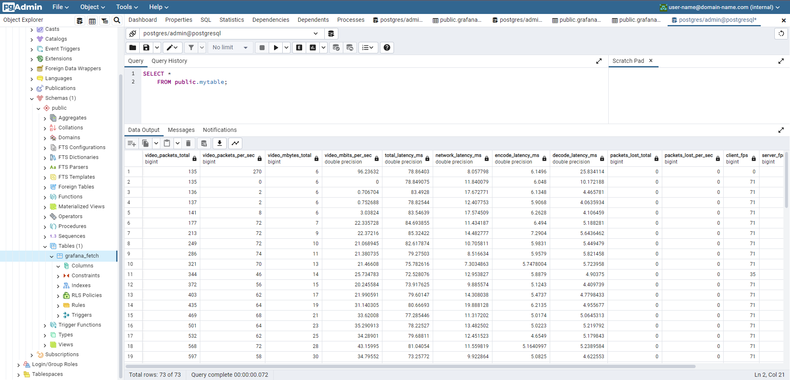
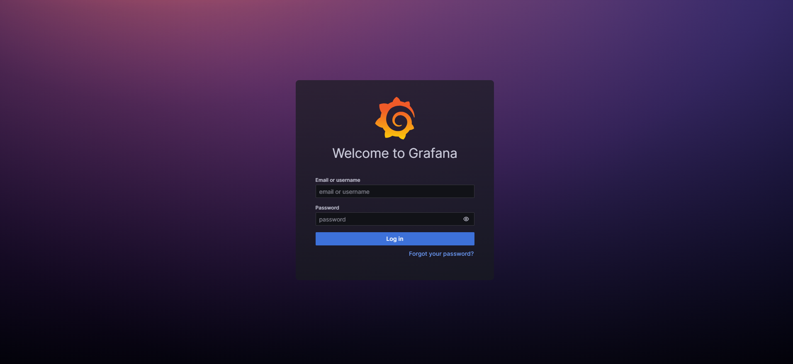
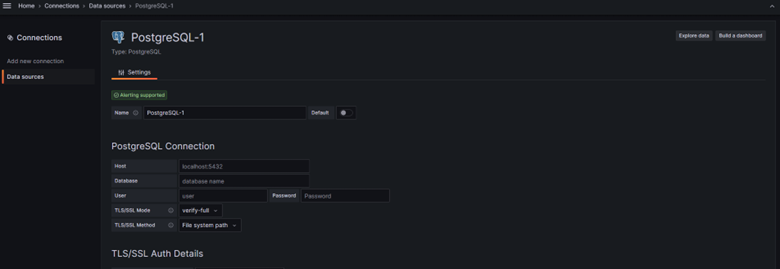
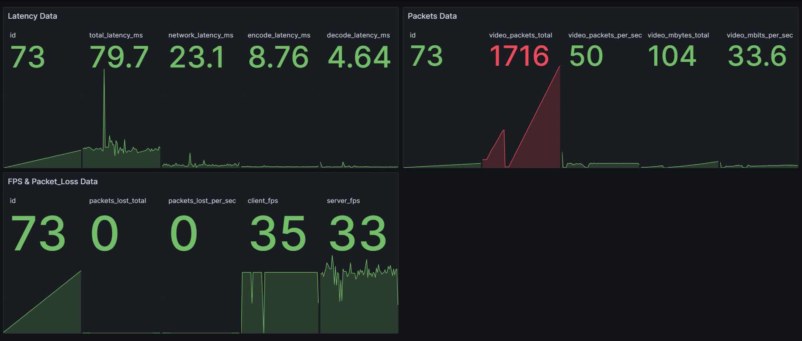

# How to bootstrap infrastructure

## Setup environment

Firstly, user required to have Docker Desktop which can be download via Docker official website [Docker Download](https://docs.docker.com/get-docker/?_gl=1*1j0a3g0*_ga*NjYwMDE4MDk1LjE2OTAyMDA0MDc.*_ga_XJWPQMJYHQ*MTY5ODQ3NDExNC4xNC4xLjE2OTg0NzQxMjMuNTEuMC4w). The advantage of this method is reduce the dependency in operating system.

## Bootstrap Docker Data Storage

Fortunately, the docker-compose script for data storage are contains multiple images of PostgreSQL and pgAdmin4 which can be setup by following this step.

```sh
# Go to database directory which contain dokcer-compose.yml for database bootstrap
cd Infrastructure/database

# Run pwd to check that you are in the right directory
pwd

# Then execute the script
docker compose up -d

```

Then go to `http:localhost:8888/` to login and connect the data, it should be like this in the picture below.



After you have login, You are required to connect with the PostgreSQL database.



Then, copy and paste the query script in resources via pgAdmin.



## Bootstrap Data Visualization

To make it more clear, I have seperate the script for Grafana in another folder which main focusing on data visualization. Please following the step below to execute the grafana.

```sh
# Go to datavisualization folder that contains the docker-compose for grafana
cd Infrastructure/datavisualization

# Run pwd to check that you are in the right directory
pwd

# Then execute the script
docker compose up -d
```

Then go to `http:localhost:3000/` and connect Grafana with PostgreSQL database for data visualization.



Connect the data source which in this case is the PostgreSQL database.



Perform the desired query to visualizaed the data.



## Reference

1. Vishal Sharma. 2023. Docker-Compose tutorial for PostgreSQl and pgAdmin4 [Link](https://medium.com/@vishal.sharma./run-postgresql-and-pgadmin-using-docker-compose-34120618bcf9)

2. Grafana. 2023. Grafana installation on Docker option [Link](https://grafana.com/docs/grafana/latest/setup-grafana/installation/docker/)

3. Konbert. 2023. Konbert web application for convert JSON to SQL query [Link](https://konbert.com/convert/json/to/postgres)

